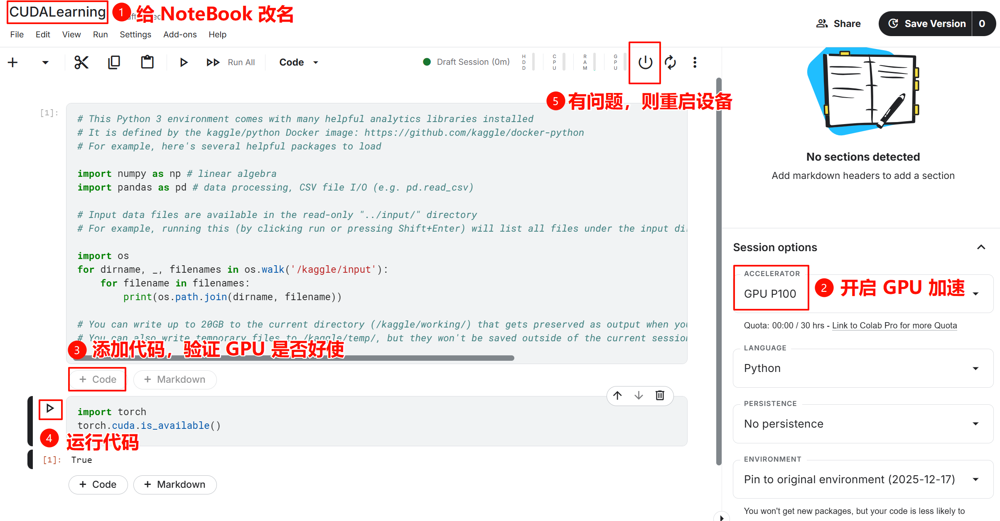
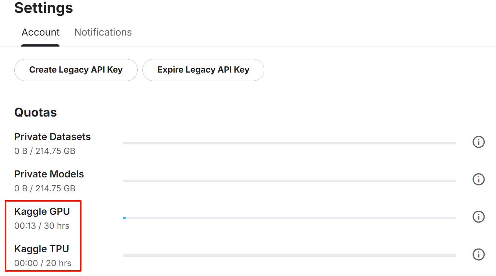
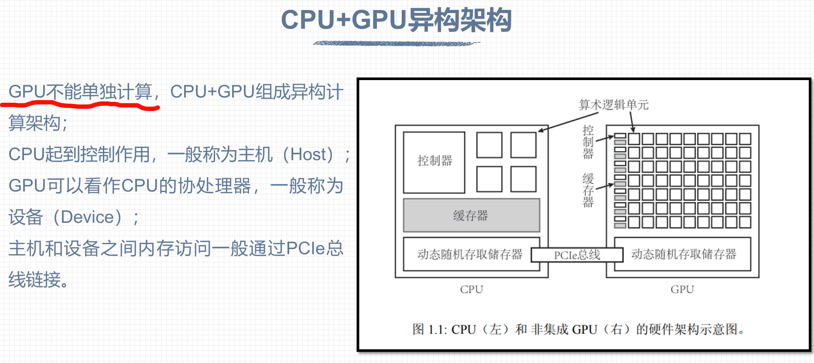
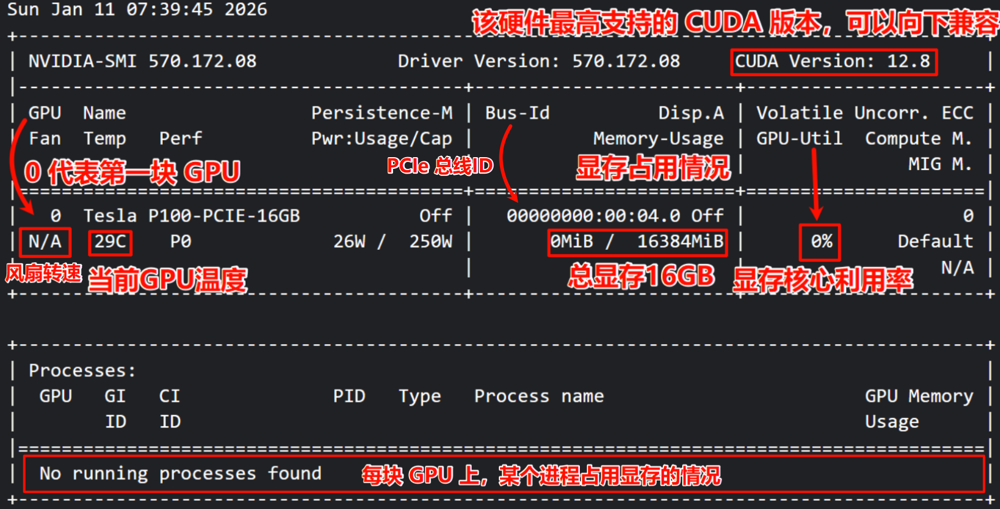
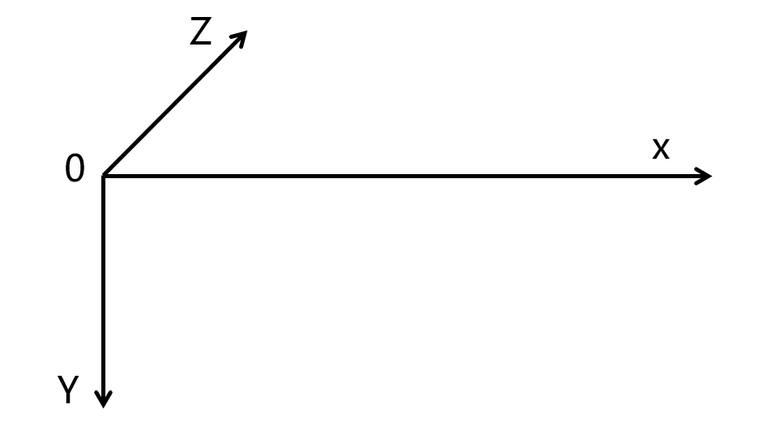
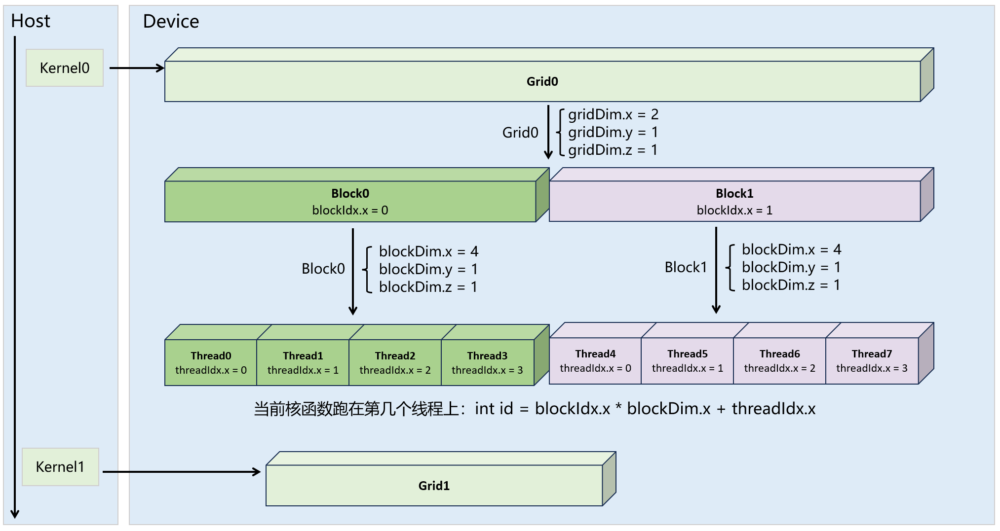
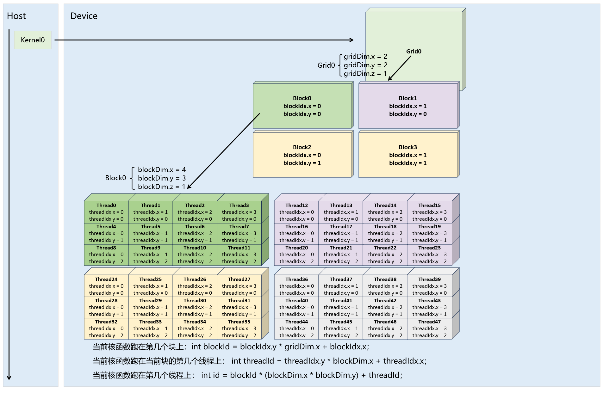
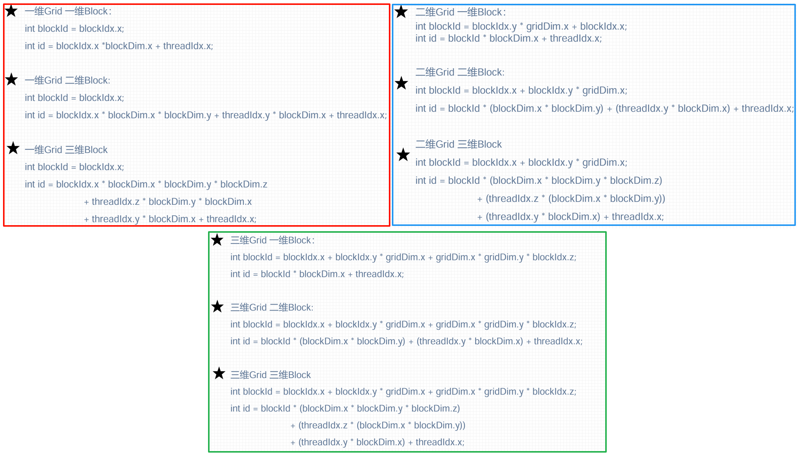
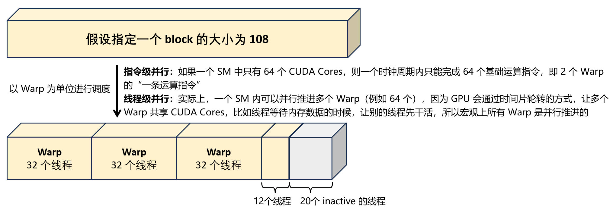

# CUDA 学习

## 一、仓库管理

```bash
# 初始化本地库
git init
# 本地库与远程库建立关联：仓库别名默认为origin
git remote add origin git@github.com:superyp2333/CUDALearning.git
git remote -v

# 将修改添加到暂存区跟踪
git add .
# 提交暂存区，形成提交记录
git commit -m "第一次提交"

# 修改上次提交
git add .
# 只合并代码修改，「保留原来的提交备注」（推荐）
git commit --amend --no-edit
# 合并代码修改 + 「同时修改提交备注」（按需使用）
git commit --amend -m "balabala"

# 拉取最新代码：单人用pull「拉取+合并，会直接报冲突」，多人用fetch「只拉取，不合并，需要手动合并」
git pull
git fetch

# 首次推送需要加 -u，将「本地的main分支」与「远程origin仓库的main分支」建立关联
git push -u origin master
# 建立起关联后，后续推送可简化
git push
```


## 二、GPU环境准备

### 2.1 Kaggle

🚀 免费的GPU环境：[Kaggle](https://www.kaggle.com/)



⚠️ 注意：手动关闭后台任务，否则GPU一直在占用，很快就把每周30小时的GPU额度用完了


✅ 查看每周剩余的GPU额度：头像 -> settings -> Quotas



### 2.2 CUDA C/Cpp

**在 Kaggle Notebook 中运行 CUDA C/Cpp 代码，需要在环境中安装一个CUDA运行插件，否则无法编译运行**

✅ 1. 验证 GPU 是否配置正确、验证 nvcc 编译器是否安装

```bash
# 查询当前机器的 GPU 硬件信息 + 显卡驱动版本 + CUDA 驱动 API 版本 + 显存占用 / 算力状态
!nvidia-smi

# 查看 CUDA C/Cpp 编译器版本
!nvcc -v
```

✅ 2. 安装 `nvcc4jupyter` 插件

```bash
# 安装插件
!pip install nvcc4jupyter

# 加载插件，让该环境支持直接编译、运行 CUDA C/Cpp 代码；在运行 CUDA 代码时，必须在代码前加上魔法命令：%%cuda
%load_ext nvcc4jupyter
```

✅ 3. 编译和运行 CUDA C/Cpp 代码

```cpp
%%cuda
#include <iostream>
using namespace std;

// GPU端 CUDA核函数：最简单的加法运算
__global__ void simple_add(int *a, int *b, int *c)
{
    *c = *a + *b;
}

int main()
{
    // CPU 端 变量 (主机端 Host)
    int a = 10, b = 20, res;
    // GPU 端 指针 (设备端 Device)
    int *d_a, *d_b, *d_c;

    // 1. 给GPU分配显存
    cudaMalloc(&d_a, sizeof(int));
    cudaMalloc(&d_b, sizeof(int));
    cudaMalloc(&d_c, sizeof(int));

    // 2. CPU数据 拷贝到 GPU显存
    cudaMemcpy(d_a, &a, sizeof(int), cudaMemcpyHostToDevice);
    cudaMemcpy(d_b, &b, sizeof(int), cudaMemcpyHostToDevice);

    // 3. 启动GPU核函数：<<<线程块数, 每个线程块的线程数>>>
    simple_add<<<1, 1>>>(d_a, d_b, d_c);

    // 4. GPU计算结果 拷贝回 CPU内存
    cudaMemcpy(&res, d_c, sizeof(int), cudaMemcpyDeviceToHost);

    // 打印结果
    cout << "CUDA验证成功！计算结果：" << a << " + " << b << " = " << res << endl;

    // 释放GPU显存（好习惯）
    cudaFree(d_a);
    cudaFree(d_b);
    cudaFree(d_c);

    return 0;
}
```

安装插件之后，可以调用底层的 nvcc 编译器，「编译」+「运行」单元格中的代码


✨ Tips：正常的编译和运行过程如下

```bash
# 假设 CUDA 代码写在 main.cu 中，则如下命令可以编译生成一个文件名为 main 的可执行文件
nvcc main.cu -o main

# 运行 CUDA 代码
./main
```


## 三、CUDA编程入门

### 3.1 GPU 的基本架构

> **GPU 芯片** → 包含多个 **SM 处理器** → 每个 SM 包含多个 **SP 处理器（CUDA 核心）** + 缓存 + 线程调度器 + 指令单元

✅ GPU 实际上是由多个「SM」(Streaming Multiprocessor，流多处理器) 组成的阵列

* 「SM」内部包含数十个「SP」(Streaming Processors, 流处理器），以及配套的线程调度器、共享内存、指令单元等资源
* 「SP」也称为 CUDA 核心，**它的本质是单指令计算核心：一个核心在某个时刻，只能执行一条指令（比如加减乘除、浮点运算）**


🚀 **以 Tesla P100 为例**

已知它共有 3584 个核心，每个 「SM」共 64 个「SP」，因此它共有 3584/64 = 56 个「SM」

也就说 Tesla P100 芯片，是由 **56 个独立的 SM 计算集群** 组成的，每个集群又包含 64 个流处理器，再加上配套的缓存和调度器

| SM 内部组件                    | 数量（每 SM）                     | 作用                                                         |
| ------------------------------ | --------------------------------- | ------------------------------------------------------------ |
| 流处理器（CUDA 核心）          | 64 个                             | 执行单精度浮点运算、整数运算                                 |
| 双精度浮点核心（FP64 核心）    | 32 个                             | 执行高精度浮点运算（科学计算 / 深度学习常用）                |
| 控制单元（Control Unit）       | 2 个                              | 解码 CUDA 指令，分发给流处理器                               |
| 寄存器文件（Register File）    | 256 KB（共 65536 个 32 位寄存器） | 每个 SM 被分成两个处理块，因此每个处理块包含 32768 个 32 位寄存器，线程启动时从寄存器文件分配固定数量的寄存器<br />寄存器为每个线程私有的存储空间，访问速度极快！ |
| 共享内存（Shared Memory）      | 64 KB                             | SM 内所有 SP 共享的高速缓存，比显存快 10~100 倍              |
| 线程束调度器（Warp Scheduler） | 2 个                              | 负责调度 SM 内的线程束（32 个线程为一束），分配到 SP 执行    |

> 随着架构的演进，GPU中出现了更多专用的计算核心，例如：张量核心（Tensor Core）
>
> 专门加速深度学习中的张量运算（如矩阵乘法、卷积），支持混合精度计算（FP16、BF16、TF32、FP8）

✨ **概念等价性：流处理器 = GPU 核心 = CUDA核心**

* 「流处理器」是硬件领域的通用叫法
* 「GPU 核心」是用户层面的通俗叫法
* 「CUDA 核心」是 NVIDIA 针对 CUDA 编程的专属叫法
* 三者都指向同一个硬件电路模块 -> 你可以理解为：**GPU 最小的计算「工人」**


✨ **「SM」与 「SP」的关系**

用「军队编制」的类比，能把两者的关系讲得最清楚

| 硬件层级                            | 军队编制       | 作用                                                 | 举例说明：Tesla P100 配置                                    |
| ----------------------------------- | -------------- | ---------------------------------------------------- | ------------------------------------------------------------ |
| GPU 芯片                            | 整个军团       | 独立的计算硬件实体                                   | Tesla P100 芯片                                              |
| SM                                  | 一个「作战营」 | GPU 的基本调度单位，CUDA 驱动 **按「SM」分配任务**   | 共 56 个作战营                                               |
| SP（CUDA 核心）                     | 营里的「士兵」 | 最小的计算执行者，士兵归营长「SM」管理               | 每个营 64 名士兵 → 总计 3584 名                              |
| Warp（线程束，每 32 个线程为 1 束） | 32个任务       | 32个任务（同指令，异数据），需要 32 个士兵同时来干32 | 一个 warp（32个线程）共享同一条指令，并行处理不同的数据      |
| Warp Scheduler（线程束调度器）      | 排长           | 不执行任务，只负责分配任务给士兵                     | 每个 SM 里有 **2 个线程束调度器** -> 相当于一个作战营里有两个分配任务的排长 |

⚠️ 注意：线程束调度器调度的 **32 个线程是绑定在一起的** -> 它们必须同时执行**完全相同的指令**，但是处理的数据可以不一样

> 比如：同时给数组元素乘 2，但是每个线程处理不同 idx 的元素
>
> 这就是所谓的「SIMT，单指令多线程」模式


✨ **「核心」与「线程」的关系**

* 核心 (Core)-> 硬件物理实体，真实的「计算单元」
  * 核心的数量是**出厂固定的**，比如 Tesla P100 有 3584 个核心，永远不会变
  * 核心的唯一作用：**执行计算指令**（加减乘除、逻辑运算等），一个核心在一个时刻只能执行「一个基础计算指令」
  * 核心是「算力的硬件载体」，核心越多，理论算力越高
* 线程 (Thread) -> 软件逻辑实体，虚拟的「执行任务」
  * 一个线程 =「一段要被执行的代码逻辑」，因此线程是**软件层面动态创建的**，数量理论上可以无限多（实际上受内存限制），比如 CUDA 核函数可以启动 1000/10000/100万个线程
  * 线程的唯一作用：**承载一段要执行的代码**，线程需要「绑定到核心上」才能被执行，线程本身不能产生算力
  * 线程是「任务的软件载体」，线程越多，代表被并行执行的任务越多


✨ **线程如何绑定到核心上？**

* 第一步：CPU 总指挥 -> 下达任务，创建 100 万个线程
* 第二步：CUDA 驱动会把这 100 万个线程，按我指定的规格（`256线程/块`），拆分成 3907 个线程块（1000000/256≈3907），因此每个线程块 = 8 个 Warp（256÷32=8），然后驱动会把这 3907 个线程块，均匀分配给 P100 的 **56 个 SM 作战营**
* 第三步：每个 SM 作战营收到 N 个线程块，营里有 2 个调度队长会把每个线程块拆分成 8 个 warp（256/32=8），所以整个营一共有 8N 个 warp
* 第四步：因为每个 SM 作战营共有 2 个调度队长，所以每次可以派发 2 个 Warp 给营里的士兵，让他们同时来干，因此每个士兵每次可以领到一个线程，干完了再领下一个线程，永远有活干，不会闲置。
  * 1 个 Warp 需要 32 个 SP 并行执行，2 个 Warp 就可以喂饱整个 SM 共 64 个 SP
  * 每个 SP 干完了手中的线程又会被 Warp Scheduler 分配到下一个线程，保证了每个 SP 都是满负荷运转
  * 因此 GPU 以极小的硬件代价，在每个 SM 中设置了 2 个 Warp Scheduler，从而实现了让 64 个 SP 的利用率将近 100%！

### 3.2 异构计算架构



✅ **什么是「CPU+GPU 异构计算」？**

✔️ 通俗大白话定义

> CPU+GPU 异构计算 = **让 CPU 和 GPU「分工协作、各尽其能」完成同一个计算任务**，把合适的代码交给合适的硬件去跑，最终实现「1+1 >> 2」的极致加速效果。


✅ **为什么需要 CPU+GPU 异构计算？**

✔️ CPU 和 GPU 的「硬件架构 + 算力特点」核心对比

| 硬件 | 核心架构特点                                                 | 算力优势                                                     | 算力短板                                                 |
| :--- | :----------------------------------------------------------- | :----------------------------------------------------------- | :------------------------------------------------------- |
| CPU  | 「少核心 + 强单核」，一般 8/16/32 核心，核心主频高、缓存大、逻辑控制能力极强 | 擅长**复杂逻辑判断、串行计算、分支跳转、任务调度**           | 并行计算能力弱，算力天花板低，处理大规模数据循环速度极慢 |
| GPU  | 「超多核心 + 弱单核」，Tesla P100 拥有 **3584 个流处理器 (核心)**，核心主频低，但核心数量是 CPU 的几百倍 | 擅长**无脑并行计算、无分支的海量数据循环、矩阵运算、向量运算**，算力是 CPU 的**50~200 倍** | 逻辑判断能力弱，分支多的代码会大幅降速，单核心执行效率低 |

🔥 一句话总结

>**CPU 是「大脑 / 指挥官」**：负责统筹全局、发号施令、处理复杂逻辑、读写文件
>
>**GPU 是「千军万马 / 苦力大军」**：负责执行海量、重复、简单的并行计算任务
>
>异构计算 = CPU 指挥，GPU 干活，完美分工！


✅ **CPU+GPU 异构计算的「标准工作流程」（所有 CUDA 代码都遵循这个流程）**

⚠️ 前置说明：

* 在异构计算中，GPU 实际上是 CPU 的外设，因此CPU 管理的内存叫**「主机内存 (Host Memory)」**，GPU 管理的内存叫**「设备内存 (Device Memory)，也叫显存」**

* 两者物理隔离、互不互通，数据传输经过**「PCIe 高速总线」**进行拷贝




**1、CPU 初始化任务（CPU 干活）**

* CPU 负责：定义计算任务、初始化「主机内存」**（变量/数组/矩阵、读取数据集）**、设置计算参数**（数据量大小、线程块配置）**

**2、CPU 给 GPU 分配显存（CPU 发指令，GPU 执行）**

* CPU 调用 CUDA API `cudaMalloc(&设备指针, 内存大小)`

* 作用：向 GPU 申请一块「设备内存」，用来存放 GPU 要计算的数据，该内存**只有 GPU 能访问**，CPU 不能直接读写

  > 对于我：Tesla P100 显卡拥有 16G 显存，我就可以申请超大数组（比如千万级 float 数组）

**3、CPU → GPU 数据拷贝（CPU 发指令，硬件执行）**

* CPU 调用 CUDA API：`cudaMemcpy(设备指针, 主机指针, 内存大小, cudaMemcpyHostToDevice)`

* 作用：把「CPU 主机内存」中的「待计算数据」，通过 PCIe 高速总线，拷贝到「GPU 设备内存」中

* 核心注意：**「数据搬运环节」是异构计算中唯一的性能损耗点**，但对于大规模计算，这点损耗完全可以忽略（计算收益远大于拷贝损耗）

  > 对于我：Tesla P100 显卡的 PCIe 接口，带宽充足，数据拷贝速度极快，不需要优化

**4、CPU 启动 GPU 核函数，执行并行计算（CPU 发指令，GPU 满负荷干活）**

* CPU 调用 CUDA 核函数：`核函数名<<<线程块数, 线程数>>>(GPU参数列表)`

* 作用：CPU 下达计算指令，GPU 立刻启动**成百上千个线程**，并行执行核函数中的计算逻辑，此时 GPU 的利用率会瞬间飙升到 50%~100%（可以用`nvidia-smi`看到`GPU-Util`上涨）

* 核心语法：`<<<grid, block>>>` 是 CUDA 的「线程配置语法」，专门用来告诉 GPU 用多少线程来并行计算

  > 对于我：Tesla P100 支持超大线程配置，轻松并行处理百万级数据，算力拉满！

**5、GPU → CPU 结果拷贝（CPU 发指令，硬件执行）**

* CPU 调用 CUDA API：`cudaMemcpy(主机指针, 设备指针, 内存大小, cudaMemcpyDeviceToHost)`
* 作用：把 GPU 计算完成的「结果数据」，从 「GPU 设备内存」拷贝回 「CPU 主机内存」

**6、释放内存 + 收尾工作（CPU 干活）**

* CPU 调用 CUDA API：`cudaFree(设备指针)` 释放 GPU 显存；调用 `free/delete` 释放 CPU 内存
* 避免内存泄漏，尤其是 GPU 显存 不释放会一直占用（`nvidia-smi`能看到显存占用不回落）


### 3.3 CUDA 线程模型


✅ **thread、block、grid 只是逻辑分层的概念**

* **thread（线程）**：1 个 CUDA 的并行程序（核函数）会被许多 thread 来执行

* **block（线程块）**：多个 thread 构成一个 block

  * 规则：1 个 block 永远绑定 1 个 SM，1 个 SM 可以调度多个 Block

  * 因此 block 中所有的 thread 从头到尾都在 `同 1 个 SM` 中执行，不会被拆分给其他 SM

  * 好处：可以利用 SM 内部的「shared memory」`互相通信`，同 1 个 block 中的 thread `可以被同步`

    > 同步的概念：通过 CUDA 的同步函数 `__syncthreads()`，可以让同一个 Block 的所有 Thread 
    >
    > 「在执行到某一行代码时，全部暂停，等其他 Thread 都到这一行，再一起继续往下执行」

  * 绝大多数 GPU 架构中，1 个 block 中最多有 1024 个 thread，这是硬件上限，无法突破

* **grid（线程网格）**：多个 block 则再构成 1 个 grid

  * 规则：启动 1 个 核函数，只会生成 1 个独立的 grid，代表这个核函数的「全部线程任务」


⚠️ 注意：block 和 grid 可以多维的，这个“维度”只是逻辑划分，本质是为了降低 CUDA 编程的复杂性，**而对一维线程空间的逻辑封装**

CUDA线程模型的坐标系如下：



✅ **一维Grid，一维block 线程模型:**

启动核函数时，定义 grid 和 block 的尺寸

```cpp
dim3 gird_size(2);  // 1 个 grid 共 2 个 block -> 等价于 dim3 gird_size(2, 1, 1)
dim3 block_size(4); // 每 个 block 共 4 个 thread -> 等价于 dim3 block_size(4, 1, 1)
kernel_function<<<gird_size, block_size>>>(); 
```



✅ **二维grid，二维blcok 线程模型**

```cpp
dim3 gird_size(2, 2);  // 1 个 grid 共 2*2=4 个 block
dim3 block_size(4, 3); // 每 个 block 共 4*3=12 个 thread
kernel_function<<<gird_size, block_size>>>(); 
```



✅ **所有维度网格的线程索引计算方式**




### 3.4 Warp调度的本质

[参考：CUDA -- Warp解析](https://www.cnblogs.com/1024incn/p/4541313.html)

✅ **逻辑上，所有thread是并行的，但是，从硬件的角度来说，实际上并不是所有的 thread 能够在同一时刻执行**

> --> 因为 SM 中 CUDA 核心的数量有限，是以 Warp 为单位去调度的

举例：对于Tesla P100 型号的 GPU 来说

假设开了一个 1024 个线程的block，SM 在调度的时候，这 1024 个线程会被划分成 32 个 Warp

SM 会依次调度这些 Warp 到 CUDA core 上运行，而不是让 CUDA core 和线程一对一匹配

| 参数                   | Tesla P100 型号的 GPU | 说明                                                         |
| ---------------------- | --------------------- | ------------------------------------------------------------ |
| 单个 SM 最大 thread 数 | 2048                  | 一个 SM 最多同时承载 2048 个线程<br />因此一个 SM 最多能运行 2 个 1024 线程的 block |
| 单个 SM 最大 block 数  | 32                    | 一个 SM 最多同时运行 32 个 block<br />（若单个 block 的线程数为 64，则 32×64=2048，刚满足 SM 上限） |
| Warp                   | 32                    | 固定值，所有 GPU 都一样；因此建议 block 的线程数为 32 的整数倍 |


⚠️ 注意：如果 block 中的 thread 不是 Warp 的整数倍，那些多余的 thread 所在的 Warp 中，会剩余一些 inactive 的thread

> 也就是说，即使凑不够 Warp 整数倍的thread，硬件也会为 Warp 凑足，只不过那些 thread 是 inactive 状态
>
> 需要注意的是，即使这部分 thread 是inactive的，也会消耗 SM 资源
>
> **所以在分配线程的时候，最好指定一个 block 中的线程数为 32 的整数倍，否则会有冗余的资源消耗**



✅ **Warp divergence，线程束分歧**

Warp Divergence 是 SIMT（单指令多线程）模式下的特有现象：

> GPU 的硬件设计就决定了他没办法做很好的分支预测，而 **同一个 Warp 中的 thread 必须执行相同的指令**
>
> 当一个 Warp内的 32 个 thread 因条件分支（如 if-else、switch、循环条件）执行不同的指令路径时，GPU 会串行执行每个分支路径，而没有执行当前路径的 thread 会被暂时阻塞（空转），直到所有分支执行完毕，thread 才会重新同步，极大浪费性能


优化方法：

1. 对简单的 if-else 分支，通过**三元运算符、位运算、数学掩码**消除分支指令，让所有线程执行同一套计算逻辑
2. 让 “需要执行相同逻辑的数据” 连续存储，确保同一个 Warp 的 32 个线程处理的是同一类数据
   * **反例**：`[类0, 类1, 类0, 类2, ...]` -> 数据乱序存储，同一 Warp 内线程处理不同类别，分支分歧严重
   * **正例**：`[类0×N, 类1×N, 类2×N, ...]` -> 数据按类别分块存储，同一个 Warp 的 32 个线程全部处理同一类别，无分支

3. 避免 Warp 内线程的循环次数不一致，例如 `for (int i=0; i<threadIdx.x; i++)`
4. 分支外提（把分支移到 Warp/Block 级别）
5. 用 CUDA 内置函数 / 编译器优化

## 四、算子实战

### 4.1 简单的程序


